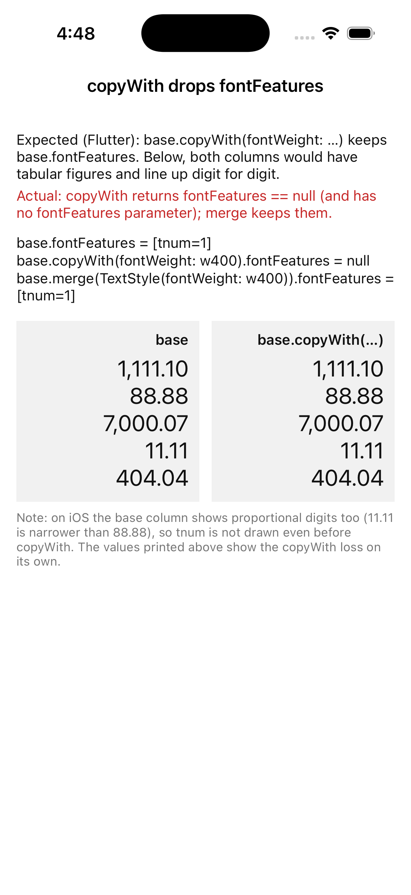

# Repro: `TextStyle.copyWith` drops `fontFeatures` (and has no `fontFeatures` parameter)

Issue: https://github.com/DartNative/dartnative/issues/61

In DartNative 1.0.0, `TextStyle.copyWith` has no `fontFeatures` (or `fontVariations`) parameter, and the style it returns has `fontFeatures == null` even when the base style had them. `merge` keeps them. An app that defines one tabular-figures number style and derives weights or colours from it with `copyWith` loses `tnum`, so amounts in a right-aligned column stop lining up.

## Run

`dn run` (iOS simulator; Android behaves the same unless stated).

## What you'll see

- Three printed values: `base.fontFeatures = [tnum=1]`, `base.copyWith(fontWeight: w400).fontFeatures = null`, `base.merge(TextStyle(fontWeight: w400)).fontFeatures = [tnum=1]`.
- Two right-aligned columns of the same amounts (`1,111.10`, `88.88`, `7,000.07`, `11.11`, `404.04`): the left one uses `base`, the right one `base.copyWith(fontWeight: FontWeight.w400)` (the base weight again, so the only difference is the lost `fontFeatures`).
- On iOS both columns look the same, with proportional digits (`11.11` is narrower than `88.88`): `tnum` isn't drawn for the system font even in the base column, in `Text` or `RichText`. So the screen can't show the misalignment `copyWith` would cause; the printed values show the loss. (With a font that draws `tnum`, the right column would lose its alignment.)

## Expected

As in Flutter: `copyWith` keeps every field it isn't given, `fontFeatures` included, and accepts `fontFeatures` / `fontVariations` to replace them. Both columns would look the same.

## Recording

## Environment

- DartNative 1.0.0 (SDK `113c27aacb2`, framework edition `7ae29132`), Dart 3.12.0
- macOS 26.7.1, Xcode 26.1.1
- iPhone 17 simulator, iOS 26.1
